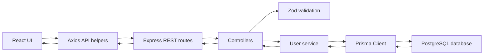

# User Management App

A simple full-stack CRUD application for managing users. The project uses a React frontend, an Express TypeScript backend, Prisma ORM, and a local PostgreSQL database.

## Tech Stack

### Backend

- Node.js
- Express.js
- TypeScript
- Prisma ORM
- PostgreSQL
- Zod
- CORS
- dotenv

### Frontend

- Vite
- React
- TypeScript
- Axios
- React Hook Form
- Zod
- `@hookform/resolvers`
- `lucide-react`
- CSS

## Project Structure

```txt
.
|-- backend
|   |-- prisma
|   |   |-- migrations
|   |   `-- schema.prisma
|   |-- src
|   |   |-- controllers
|   |   |   `-- user.controller.ts
|   |   |-- routes
|   |   |   `-- user.routes.ts
|   |   |-- services
|   |   |   `-- user.service.ts
|   |   |-- validations
|   |   |   `-- user.validation.ts
|   |   |-- index.ts
|   |   `-- prisma.ts
|   |-- .env
|   |-- package.json
|   `-- tsconfig.json
`-- frontend
    |-- src
    |   |-- api
    |   |   `-- users.ts
    |   |-- components
    |   |   |-- UserForm.tsx
    |   |   `-- UserList.tsx
    |   |-- validations
    |   |   `-- user.validation.ts
    |   |-- App.tsx
    |   |-- main.tsx
    |   `-- styles.css
    |-- package.json
    |-- tsconfig.json
    `-- vite.config.ts
```

## High-Level Application Flow



1. The React app loads and calls `GET /users` through Axios.
2. Axios sends requests to the Express backend at `http://localhost:4000`.
3. Express routes forward requests to controller functions.
4. Controllers validate params and request bodies with Zod.
5. Services call Prisma Client to query or mutate PostgreSQL.
6. Prisma reads from or writes to the `User` table.
7. The backend returns JSON responses to the frontend.
8. The frontend refreshes the user list after create, update, or delete.

## Environment

Backend `.env`:

```env
DATABASE_URL="postgresql://postgres@localhost:5432/purwadhika_3_9?schema=public"
PORT=4000
FRONTEND_URL="http://localhost:5173"
```

Important ports:

- PostgreSQL database: `5432`
- Express backend API: `4000`
- Vite frontend: `5173`

## Database Model

The Prisma model is defined in `backend/prisma/schema.prisma`.

```prisma
model User {
  id    Int    @id @default(autoincrement())
  name  String
  email String @unique
}
```

Fields:

- `id`: auto-incrementing integer primary key
- `name`: required string
- `email`: required unique string

## Setup and Run

### 1. Install backend dependencies

```bash
cd backend
npm install
```

### 2. Install frontend dependencies

```bash
cd frontend
npm install
```

### 3. Create the PostgreSQL database

If the database does not exist yet and you do not have `createdb` or `psql` available, run this from the `backend` folder:

```bash
printf 'CREATE DATABASE purwadhika_3_9;' | npx prisma db execute --url "postgresql://postgres@localhost:5432/postgres?schema=public" --stdin
```

### 4. Generate Prisma Client

```bash
cd backend
npm run prisma:generate
```

### 5. Run Prisma migration

```bash
cd backend
npm run prisma:migrate
```

This applies the migration that creates the `User` table and the unique email index.

### 6. Start the backend

```bash
cd backend
npm run dev
```

Backend URL:

```txt
http://localhost:4000
```

### 7. Start the frontend

```bash
cd frontend
npm run dev
```

Frontend URL:

```txt
http://localhost:5173
```

## Backend Function Guide

### Express App Setup

File: `backend/src/index.ts`

This file creates the Express app, enables CORS, enables JSON request parsing, mounts the `/users` routes, handles server errors, starts the server, and disconnects Prisma during shutdown.

```ts
const app = express();
const port = Number(process.env.PORT) || 4000;
const frontendUrl = process.env.FRONTEND_URL || "http://localhost:5173";
const allowedOrigins = new Set([frontendUrl, "http://localhost:5173", "http://127.0.0.1:5173"]);

app.use(
  cors({
    origin(origin, callback) {
      if (!origin || allowedOrigins.has(origin)) {
        callback(null, true);
        return;
      }

      callback(new Error("Not allowed by CORS"));
    }
  })
);
app.use(express.json());
app.use("/users", userRouter);
```

`errorHandler` catches errors that reach Express and returns a clear JSON response.

```ts
const errorHandler: ErrorRequestHandler = (error, _request, response, _next) => {
  console.error(error);
  response.status(500).json({
    message: "Internal server error"
  });
};
```

`shutdown` disconnects Prisma before the server exits.

```ts
const shutdown = async () => {
  await prisma.$disconnect();
  server.close(() => {
    process.exit(0);
  });
};
```

### Prisma Client

File: `backend/src/prisma.ts`

Creates one Prisma Client instance used by the service layer.

```ts
import { PrismaClient } from "@prisma/client";

export const prisma = new PrismaClient();
```

### Backend Validation

File: `backend/src/validations/user.validation.ts`

`userSchema` validates request bodies for create and update operations.

```ts
export const userSchema = z.object({
  name: z.string().trim().min(1, "Name is required"),
  email: z.string().trim().min(1, "Email is required").email("Email must be valid")
});
```

Validation rules:

- `name` is required.
- `email` is required.
- `email` must use a valid email format.

### User Routes

File: `backend/src/routes/user.routes.ts`

`asyncHandler` wraps async controllers so rejected promises are forwarded to the Express error handler.

```ts
const asyncHandler = (handler: AsyncController): RequestHandler => {
  return (request, response, next) => {
    Promise.resolve(handler(request, response, next)).catch(next);
  };
};
```

Route mapping:

```ts
userRouter.get("/", asyncHandler(listUsers));
userRouter.get("/:id", asyncHandler(findUser));
userRouter.post("/", asyncHandler(addUser));
userRouter.put("/:id", asyncHandler(editUser));
userRouter.delete("/:id", asyncHandler(removeUser));
```

### User Services

File: `backend/src/services/user.service.ts`

The service layer contains database operations. Controllers call these functions instead of using Prisma directly.

`getUsers` returns all users ordered by `id`.

```ts
export const getUsers = () => {
  return prisma.user.findMany({
    orderBy: { id: "asc" }
  });
};
```

`getUserById` returns one user by primary key.

```ts
export const getUserById = (id: number) => {
  return prisma.user.findUnique({
    where: { id }
  });
};
```

`createUser` inserts a new user.

```ts
export const createUser = (data: UserInput) => {
  return prisma.user.create({
    data
  });
};
```

`updateUser` updates an existing user by `id`.

```ts
export const updateUser = (id: number, data: UserInput) => {
  return prisma.user.update({
    where: { id },
    data
  });
};
```

`deleteUser` removes one user by `id`.

```ts
export const deleteUser = (id: number) => {
  return prisma.user.delete({
    where: { id }
  });
};
```

`isDuplicateEmailError` checks for Prisma unique constraint errors.

```ts
export const isDuplicateEmailError = (error: unknown) => {
  return error instanceof Prisma.PrismaClientKnownRequestError && error.code === "P2002";
};
```

`isRecordNotFoundError` checks for Prisma record-not-found errors.

```ts
export const isRecordNotFoundError = (error: unknown) => {
  return error instanceof Prisma.PrismaClientKnownRequestError && error.code === "P2025";
};
```

### User Controllers

File: `backend/src/controllers/user.controller.ts`

`sendValidationError` returns a consistent `400` response when Zod validation fails.

```ts
const sendValidationError = (response: Response, error: z.ZodError) => {
  return response.status(400).json({
    message: "Validation failed",
    errors: error.flatten().fieldErrors
  });
};
```

`parseId` validates `:id` route params and converts them to positive integers.

```ts
const parseId = (request: Request, response: Response) => {
  const result = idSchema.safeParse(request.params.id);

  if (!result.success) {
    response.status(400).json({
      message: "Invalid user id"
    });
    return null;
  }

  return result.data;
};
```

`listUsers` handles `GET /users`.

```ts
export const listUsers = async (_request: Request, response: Response) => {
  const users = await getUsers();
  return response.json(users);
};
```

`findUser` handles `GET /users/:id`.

```ts
export const findUser = async (request: Request, response: Response) => {
  const id = parseId(request, response);
  if (!id) return;

  const user = await getUserById(id);

  if (!user) {
    return response.status(404).json({
      message: "User not found"
    });
  }

  return response.json(user);
};
```

`addUser` handles `POST /users`. It validates the body and returns `409` when the email already exists.

```ts
export const addUser = async (request: Request, response: Response) => {
  const result = userSchema.safeParse(request.body);

  if (!result.success) {
    return sendValidationError(response, result.error);
  }

  try {
    const user = await createUser(result.data);
    return response.status(201).json(user);
  } catch (error) {
    if (isDuplicateEmailError(error)) {
      return response.status(409).json({
        message: "Email is already registered"
      });
    }

    throw error;
  }
};
```

`editUser` handles `PUT /users/:id`. It validates params, validates the body, handles duplicate emails, and handles missing users.

```ts
export const editUser = async (request: Request, response: Response) => {
  const id = parseId(request, response);
  if (!id) return;

  const result = userSchema.safeParse(request.body);

  if (!result.success) {
    return sendValidationError(response, result.error);
  }

  try {
    const user = await updateUser(id, result.data);
    return response.json(user);
  } catch (error) {
    if (isDuplicateEmailError(error)) {
      return response.status(409).json({
        message: "Email is already registered"
      });
    }

    if (isRecordNotFoundError(error)) {
      return response.status(404).json({
        message: "User not found"
      });
    }

    throw error;
  }
};
```

`removeUser` handles `DELETE /users/:id`.

```ts
export const removeUser = async (request: Request, response: Response) => {
  const id = parseId(request, response);
  if (!id) return;

  try {
    await deleteUser(id);
    return response.status(204).send();
  } catch (error) {
    if (isRecordNotFoundError(error)) {
      return response.status(404).json({
        message: "User not found"
      });
    }

    throw error;
  }
};
```

## Frontend Function Guide

### Axios API Helpers

File: `frontend/src/api/users.ts`

`api` configures Axios to call the backend server.

```ts
export const api = axios.create({
  baseURL: import.meta.env.VITE_API_URL || "http://localhost:4000"
});
```

`getUsers` fetches all users.

```ts
export const getUsers = async () => {
  const response = await api.get<User[]>("/users");
  return response.data;
};
```

`createUser` sends a `POST /users` request.

```ts
export const createUser = async (data: UserFormData) => {
  const response = await api.post<User>("/users", data);
  return response.data;
};
```

`updateUser` sends a `PUT /users/:id` request.

```ts
export const updateUser = async (id: number, data: UserFormData) => {
  const response = await api.put<User>(`/users/${id}`, data);
  return response.data;
};
```

`deleteUser` sends a `DELETE /users/:id` request.

```ts
export const deleteUser = async (id: number) => {
  await api.delete(`/users/${id}`);
};
```

### Frontend Validation

File: `frontend/src/validations/user.validation.ts`

The frontend uses the same validation rules as the backend.

```ts
export const userSchema = z.object({
  name: z.string().trim().min(1, "Name is required"),
  email: z.string().trim().min(1, "Email is required").email("Email must be valid")
});
```

### App State and Actions

File: `frontend/src/App.tsx`

`getApiErrorMessage` extracts a readable message from Axios errors.

```ts
const getApiErrorMessage = (error: unknown) => {
  if (axios.isAxiosError<{ message?: string }>(error)) {
    return error.response?.data?.message ?? "Request failed. Please try again.";
  }

  return "Something went wrong. Please try again.";
};
```

`loadUsers` fetches the latest users and updates loading/error states.

```ts
const loadUsers = async () => {
  setPageError("");
  setIsLoading(true);

  try {
    const data = await getUsers();
    setUsers(data);
  } catch (error) {
    setPageError(getApiErrorMessage(error));
  } finally {
    setIsLoading(false);
  }
};
```

`handleSubmit` creates a user when there is no `editingUser`, or updates the selected user when edit mode is active. After success, it refreshes the list.

```ts
const handleSubmit = async (data: UserFormData) => {
  setFormError("");
  setIsSubmitting(true);

  try {
    if (editingUser) {
      await updateUser(editingUser.id, data);
    } else {
      await createUser(data);
    }

    setEditingUser(null);
    await loadUsers();
  } catch (error) {
    setFormError(getApiErrorMessage(error));
  } finally {
    setIsSubmitting(false);
  }
};
```

`handleDelete` deletes one user and refreshes the list afterward.

```ts
const handleDelete = async (id: number) => {
  setPageError("");

  try {
    await deleteUser(id);

    if (editingUser?.id === id) {
      setEditingUser(null);
    }

    await loadUsers();
  } catch (error) {
    setPageError(getApiErrorMessage(error));
  }
};
```

### User Form

File: `frontend/src/components/UserForm.tsx`

`useForm` connects React Hook Form to Zod validation through `zodResolver`.

```tsx
const {
  register,
  handleSubmit,
  reset,
  formState: { errors }
} = useForm<UserFormData>({
  resolver: zodResolver(userSchema),
  defaultValues: {
    name: "",
    email: ""
  }
});
```

The `useEffect` updates form values when the user clicks edit.

```tsx
useEffect(() => {
  reset({
    name: editingUser?.name ?? "",
    email: editingUser?.email ?? ""
  });
}, [editingUser, reset]);
```

`submitForm` calls the parent submit handler and clears the form after creating a new user.

```tsx
const submitForm = async (data: UserFormData) => {
  await onSubmit(data);

  if (!editingUser) {
    reset({
      name: "",
      email: ""
    });
  }
};
```

### User List

File: `frontend/src/components/UserList.tsx`

`UserList` renders loading, empty, and populated states.

```tsx
if (isLoading) {
  return (
    <div className="state loading-state">
      <span aria-hidden="true" />
      Loading users...
    </div>
  );
}

if (users.length === 0) {
  return (
    <div className="state empty-state">
      <UserRound size={30} />
      <strong>No users yet.</strong>
    </div>
  );
}
```

Each user row exposes edit and delete actions.

```tsx
<button
  className="icon-button soft"
  type="button"
  onClick={() => onEdit(user)}
  title={`Edit ${user.name}`}
  aria-label={`Edit ${user.name}`}
>
  <PencilLine size={17} />
</button>

<button
  className="icon-button danger"
  type="button"
  onClick={() => onDelete(user.id)}
  title={`Delete ${user.name}`}
  aria-label={`Delete ${user.name}`}
>
  <Trash2 size={17} />
</button>
```

## API Documentation

Base URL:

```txt
http://localhost:4000
```

For Postman requests with a JSON body, use this header:

```txt
Content-Type: application/json
```

### 1. Health Check

Method:

```txt
GET
```

URL:

```txt
http://localhost:4000/
```

Description:

Returns a basic API message.

Request body:

None.

Example success response:

```json
{
  "message": "User Management API"
}
```

### 2. Get All Users

Method:

```txt
GET
```

URL:

```txt
http://localhost:4000/users
```

Description:

Returns all users ordered by `id`.

Request body:

None.

Example success response:

```json
[
  {
    "id": 1,
    "name": "Hendrik Tandiono",
    "email": "hendrik@example.com"
  }
]
```

Example empty response:

```json
[]
```

### 3. Get One User

Method:

```txt
GET
```

URL:

```txt
http://localhost:4000/users/1
```

Description:

Returns one user by `id`.

Request body:

None.

Example success response:

```json
{
  "id": 1,
  "name": "Hendrik Tandiono",
  "email": "hendrik@example.com"
}
```

Example error response:

```json
{
  "message": "User not found"
}
```

Invalid id response:

```json
{
  "message": "Invalid user id"
}
```

### 4. Create User

Method:

```txt
POST
```

URL:

```txt
http://localhost:4000/users
```

Description:

Creates a new user.

Postman body:

Choose `Body` -> `raw` -> `JSON`, then use:

```json
{
  "name": "Hendrik Tandiono",
  "email": "hendrik@example.com"
}
```

Example success response:

```json
{
  "id": 1,
  "name": "Hendrik Tandiono",
  "email": "hendrik@example.com"
}
```

Example validation error response:

```json
{
  "message": "Validation failed",
  "errors": {
    "name": ["Name is required"],
    "email": ["Email must be valid"]
  }
}
```

Example duplicate email response:

```json
{
  "message": "Email is already registered"
}
```

### 5. Update User

Method:

```txt
PUT
```

URL:

```txt
http://localhost:4000/users/1
```

Description:

Updates an existing user by `id`.

Postman body:

Choose `Body` -> `raw` -> `JSON`, then use:

```json
{
  "name": "Hendrik Updated",
  "email": "hendrik.updated@example.com"
}
```

Example success response:

```json
{
  "id": 1,
  "name": "Hendrik Updated",
  "email": "hendrik.updated@example.com"
}
```

Example validation error response:

```json
{
  "message": "Validation failed",
  "errors": {
    "email": ["Email must be valid"]
  }
}
```

Example duplicate email response:

```json
{
  "message": "Email is already registered"
}
```

Example not found response:

```json
{
  "message": "User not found"
}
```

### 6. Delete User

Method:

```txt
DELETE
```

URL:

```txt
http://localhost:4000/users/1
```

Description:

Deletes one user by `id`.

Request body:

None.

Example success response:

```txt
204 No Content
```

Example not found response:

```json
{
  "message": "User not found"
}
```

## Suggested Postman Testing Order

1. `GET http://localhost:4000/`
2. `GET http://localhost:4000/users`
3. `POST http://localhost:4000/users`
4. `GET http://localhost:4000/users`
5. `GET http://localhost:4000/users/1`
6. `PUT http://localhost:4000/users/1`
7. `POST http://localhost:4000/users` with the same email to test duplicate handling
8. `DELETE http://localhost:4000/users/1`
9. `GET http://localhost:4000/users/1` to confirm the user no longer exists

## Common Error Responses

Validation error:

```json
{
  "message": "Validation failed",
  "errors": {
    "name": ["Name is required"],
    "email": ["Email must be valid"]
  }
}
```

Duplicate email:

```json
{
  "message": "Email is already registered"
}
```

User not found:

```json
{
  "message": "User not found"
}
```

Invalid id:

```json
{
  "message": "Invalid user id"
}
```

Unexpected server error:

```json
{
  "message": "Internal server error"
}
```

## Build Checks

Backend:

```bash
cd backend
npm run build
```

Frontend:

```bash
cd frontend
npm run build
```

## Notes

- The app does not use mock data. All user records come from PostgreSQL through Prisma.
- The backend API runs on port `4000`.
- PostgreSQL runs on port `5432`.
- The frontend automatically refreshes the user list after create, update, and delete actions.
- Email uniqueness is enforced by the Prisma schema and handled gracefully by the API.
